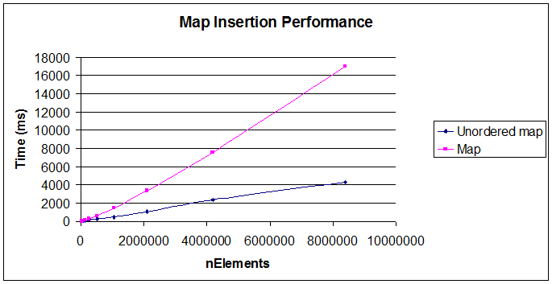

# C++ Tips

## Makefile
- [Makefile C与C++混编的简单写法](https://blog.csdn.net/qq_33195791/article/details/100584342)
- [C/C++ 编写一个通用的Makefile 来编译.c .cpp 或混编](https://www.cnblogs.com/sylar-liang/p/4792514.html)
- [大型工程多级目录代码Makefile编写](https://www.cnblogs.com/jchen2020fighting/p/12175788.html)
- [跟我一起写 Makefile-陈皓](https://blog.csdn.net/haoel/article/details/2886)

## C HOOK
- This is for C HOOK for Game
- [全系统注入-游戏安全实验室](http://gslab.qq.com/article-204-1.html)

- [游戏修改器制作教程七：注入DLL的各种姿势](http://blog.csdn.net/xfgryujk/article/details/50478295)

- [游戏注入教程（一）--远程线程注入](http://blog.csdn.net/wyansai/article/details/52077963)

- [农民工の博客-5篇文章](http://blog.csdn.net/wyansai/article/category/6328876)

- [郁金香外挂技术](http://www.yjxsoft.com/forum.php?mod=forumdisplay&fid=4)

- [外挂制作技术](http://blog.sina.com.cn/s/articlelist_1457737921_0_1.html)

- [[视频]编写代码读取游戏数据-注入DLL](http://www.iqiyi.com/w_19rteanr1h.html)

- [[讨论]绕开游戏对全局钩子的检测](http://bbs.csdn.net/topics/370046194)

- [游戏外挂编程之神器CE的使用 ](http://www.cnblogs.com/egojit/archive/2013/06/14/3135147.html)

- [游戏外挂编程三之游戏进程钩子](https://www.cnblogs.com/egojit/archive/2013/06/16/3138266.html)

- [HOOK钩子的概念](https://jingyan.baidu.com/article/e75aca855afa03142fdac643.html)

- [HOOK钩子教程](http://blog.sina.com.cn/s/blog_651cccf70100tkv6.html)

- [多线程防关,防杀,防删除自身保护程序编写思路](https://www.2cto.com/kf/201002/44758.html)

- [如何让你的程序避开全局键盘钩子的监视](http://blog.okbase.net/BlueSky/archive/3839.html)

- [[CSDN]API HOOK 全局钩子， 防止进程被杀](http://download.csdn.net/download/lygf666/4164019)
- [XueTr这个牛B工具的进程钩子检测如何实现？？](https://bbs.pediy.com/thread-163373.htm)
- [[知乎]Win10下用SetWindowsHookEx设置钩子后部分进程假死？](https://www.zhihu.com/question/64221483)
- [SetWindowsHookEx为某个进程安装钩子](http://blog.csdn.net/hczhiyue/article/details/18449455)
- [HOOK API（四）—— 进程防终止](https://www.cnblogs.com/fanling999/p/4601118.html)
- [PChunter里边有个扫描指定进程中所有钩子的功能，原理是什么？](https://bbs.pediy.com/thread-210688.htm)

- [从超过100万个项目中搜索C++ (Cpp)代码示例](https://cpp.hotexamples.com/zh/examples/-/-/SSL_pending/cpp-ssl_pending-function-examples.html)

## 驱动级注入
    教程:1、打开驱动级别的dll注入器.exe 2、加载驱动 填写要操作的进程名  填写要注入  dll的路径   3 点设置完毕  注意不要关掉
    可以打开要注入的进程测试一下，可注入大部分有保护的游戏
## 游戏应用层钩子
    1. 直接加载驱动的办法过掉钩子，不需要什么XT 
    2. 代码直接注入到游戏进程
    3. 好像很多游戏把钩子什么的都屏蔽了吧，话说我也不怎么懂啊
    @ 春色园
    是的，但是普通游戏是没有屏蔽掉的。即使屏蔽了我们还是有其它办法把我们的代码写入游戏   内存。只要技术够牛连Windows系统内核占据的内存都可以操作，何况运行在windows下的游戏进程内存？？
    4. LPWSTR s1=(LPWSTR)(LPCTSTR)txt_prc_name;
    好丑的代码，建议楼主以后不要用这样的代码了。丑陋不说，还有重大隐患。正确做法是使用   CString::GetBuffer.外挂除了实现功能外最重要是稳定，一些细节你不注意你的外挂就没  市场了。
    说到代码的健壮性，还有你的SetHook 形参没必要用LPWSTR啊，直接LPCWSTR就OK，更好的 是LPCTSTR。
    建议楼主打好扎实的基础知识，走稳了再跑。
    话可能有些不好听，请见谅

- [利用vs2019编译器远程调试linux程序（走心版）](https://blog.csdn.net/foxriver_gjg1989/article/details/102854440)
## C++ 11

- [C++11 FAQ中文版](https://wizardforcel.gitbooks.io/cpp-11-faq/content/part1.html)
- [cpp11 github](https://github.com/DragonFive/cpp11)
- [搞懂C++11中的匿名函数](https://mp.weixin.qq.com/s/w_G8qy4UMucUqZ9Is22yqw)

## C++ 20

- [C++20新特性个人总结](https://blog.csdn.net/qq811299838/article/details/105153096/)

- [代码自动生成-宏带来的奇技淫巧](http://www.cppblog.com/kevinlynx/archive/2008/03/19/44828.html)

- [C++博客](http://www.cppblog.com/)

- [使用GTEST编写C++测试用例进阶教程（GTEST advanced中文译文）](https://www.jianshu.com/p/215edbfc2e0a)

- [Advanced googletest Topics](google.github.io/googletest/advanced.html)

- [有哪些值得推荐的c/c++开源框架与库]h(ttps://zhuanlan.zhihu.com/p/71707672)

- [GoogleTest进阶——参数测试、Mock测试、耗时测试、类型测试](https://blog.csdn.net/aiyanzielf/article/details/124886079)

- [gtest参数化](https://blog.csdn.net/weixin_38988633/article/details/93312474)

- [gtest参数化测试代码示例](t.zoukankan.com/coderzh-p-gtest_demo.html)

- [Google TestExtending Google Test by Handling Test Events](https://www.cnblogs.com/jycboy/p/gtest_handlingEvent.html)

- [GoogleTest系列：TEST_P的基本用法](https://blog.csdn.net/wwwsctvcom/article/details/119173452)

- [gtest学习笔记--3 值参数化TEST_P](https://blog.csdn.net/qq_28691955/article/details/108140988?spm=1001.2101.3001.6650.1&utm_medium=distribute.pc_relevant.none-task-blog-2~default~CTRLIST~Rate-1-108140988-blog-119173452.pc_relevant_default&depth_1-utm_source=distribute.pc_relevant.none-task-blog-2~default~CTRLIST~Rate-1-108140988-blog-119173452.pc_relevant_default&utm_relevant_index=2)

- [Google Mock进阶篇 (Google Mock Cookbook译文)](https://blog.51cto.com/u_15284125/3051274)

- [Google Mock - GoogleTest（九）](https://blog.csdn.net/u012294613/article/details/124685144)

## 内存

- [C++堆，栈，RAII](https://zhuanlan.zhihu.com/p/354611651)

- [C++ 类在内存中的存储方式(一)](https://zhuanlan.zhihu.com/p/103384358)

- [C++成员函数在内存中的存储方式](https://www.cnblogs.com/rednodel/p/9300729.html)

- [C++类的实例化对象的大小之sizeof()](https://blog.csdn.net/houqd2012/article/details/40264943)

- [https://zhuanlan.zhihu.com/p/375742507](https://zhuanlan.zhihu.com/p/375742507)

## 代碼分析工具

- [RunSnakeRun](https://segmentfault.com/a/1190000000356018)
  
  RunSnakeRun有一个内存调试模式（需要 Meliae ）。遗憾的是我还没有试过。但是如果你想看到内存的使用情况，它看起来确实很有用。就像[这样](http://www.vrplumber.com/programming/runsnakerun/meliae-sample.png）。

```
KCachegrind
你可以用apt-get install kcachegrind 来安装或者从源码安装。

鲜为人知的秘密：有windows版本的KCachegrind二进制包。 只需要安装windows版本的KDE，然后在选项“开发者工具”选中它，很可能要取消选择其他项）。

我真的很喜欢这工具！它可以向你展示调用树的图表，可排序的调用表，调用/被调用的地图，源代码，而且你还能选择过滤掉所有的东西。而且它是语言无关的 – 如果你有C/C++背景的话，你很可能听说过这个工具。

我喜欢这个工具的程度超过RunSnakeRun，因为它比后者功能要强大的多：

在调用数的图表上，你可以排序，改变布局/用很多方法来渲染或者导出成点图/png，RunSnakeRun甚至不能显示调用树的图表
你可以看见源码
你可以得到被调用地图
更容易安装（不需要依赖wxPython）
在大项目里面哪些需要关注并不是那么显而易见，或者有很多的相关函数时，KCachegrind比RunSnakeRun更值得一用。
可生成KCachegrind 分析文件的工具
我想这是唯一的缺点，你需要用这种特殊的格式导出。但是它也有很好的支持：

pyprof2calltree
django扩展的 runprofileserver
装饰器
kcachegrind 转换器
repoze.profile – 只需要设置cachegrind_filename
```

## 你见过哪些令你瞠目结舌的C/C++代码技巧？

- [The International Obfuscated C Code Contest](www.ioccc.org)
- [你见过哪些令你瞠目结舌的C/C++代码技巧？](https://www.zhihu.com/question/37692782/answer/74409370)

## RapidJSON

- [RapidJSON 文档](rapidjson.org/zh-cn/)
- [RapidJSON简介及使用](https://blog.csdn.net/fengbingchun/article/details/91139889/)
- [jsoncpp VS rapidjson](https://www.zhihu.com/question/23654513)

## C++：字符串和数字的转换
```cpp

一、数字转字符串

1.1）使用 std::stringstream

1.2）使用 std 的内置函数

1.3）std 内置的数字转字符串函数列表

二、字符串转数字

2.1）使用 std::stringstream

2.2）使用 std 的内置函数

2.3）std 内置的字符串转数字函数列表

2.4）对 std::stringstream 进行包装

三、参考

一、数字转字符串
1.1）使用 std::stringstream
#include <iostream>
#include <sstream>
 
int main(int argc, char*argv[])
{
    for(int i = 0; i < 5; i++)
    {
        std::stringstream ss;
        std::string str;
        ss << i;
        ss >> str;
        std::cout << str.data() << " ";
    }
    std::cout << std::endl;
 
    return 0;
}
1.2）使用 std 的内置函数
#include <string>
#include <iostream>
 
int main(int argc, char*argv[])
{
    for(int i = 0; i < 5; i++)
    {
        std::cout << std::to_string(i).data() << " ";
    }
    std::cout << std::endl;
 
    return 0;
}
1.3）std 内置的数字转字符串函数列表
std::string to_string(int value);   
std::string to_string(long value);   
std::string to_string(long long value);
std::string to_string(unsigned value);
std::string to_string(unsigned long value);
std::string to_string(unsigned long long value);
std::string to_string(float value);
std::string to_string(double value);
std::string to_string(long double value);
二、字符串转数字
2.1）使用 std::stringstream
#include <iostream>
#include <sstream>
 
int main(int argc, char *argv[])
{
    for(int i = 0; i < 5; i++)
    {
        std::stringstream ss;
        std::string strNum = std::to_string(i);
        int num;
        ss << strNum;
        ss >> num;
        std::cout << num * num << " ";
    }
    std::cout << std::endl;
}
2.2）使用 std 的内置函数
#include <iostream>
#include <sstream>
 
int main(int argc, char *argv[])
{
    for(int i = 0; i < 5; i++)
    {
        std::stringstream ss;
        std::string strNum = std::to_string(i);
        int num = std::stoi(strNum);
        std::cout << num * num << " ";
    }
    std::cout << std::endl;
}
2.3）std 内置的字符串转数字函数列表
int std::stoi(const std::string& str,std::size_t* pos=0,int base = 10);
int std::stoi(const std::wstring& str,std::size_t* pos=0,int base = 10);
long std::stol(const std::string& str,std::size_t* pos=0,int base = 10);
long std::stol(const std::wstring& str,std::size_t* pos=0,int base = 10);
long long std::stoll(const std::string& str,std::size_t* pos=0,int base = 10);
long long  std::stoll(const std::wstring& str,std::size_t* pos=0,int base = 10);
unsigned long stoul(const std::string& str,std::size_t* pos=0,int base = 10);
unsigned long stoul(const std::wstring& str,std::size_t* pos=0,int base = 10);
unsigned long long stoull(const std::string& str,std::size_t* pos=0,int base = 10);
unsigned long long stoull(const std::wstring& str,std::size_t* pos=0,int base = 10);
float std::stof(const std::string& str,std::size_t* pos=0);
float std::stof(const std::wstring& str,std::size_t* pos=0);
double std::stod(const std::string& str,std::size_t* pos=0);
double std::stod(const std::wstring& str,std::size_t* pos=0);
long double std::stold(const std::string& str,std::size_t* pos=0);
long double std::stold(const std::wstring& str,std::size_t* pos=0);
2.4）对 std::stringstream 进行包装
使用 template 可以对接口进行统一操作：

#include <iostream>
#include <string>
#include <sstream>
 
template <typename T>
T toNumber(std::string strNum)
{
    T num = 0;
    std::stringstream ss;
    ss << strNum;
    ss >> num;
    return static_cast<T>(num);
}
 
int main(int argc, char *argv[])
{
    auto num1 = toNumber<char>("0");
    std::cout << "type " << typeid(num1).name() << " : " << num1 << std::endl;
 
    auto num2 = toNumber<int>("1");
    std::cout << "type " << typeid(num2).name() << " : " << num2 << std::endl;
 
    auto num3 = toNumber<long>("2");
    std::cout << "type " << typeid(num3).name() << " : " << num3 << std::endl;
 
    std::cout << toNumber<int>("1") + toNumber<long>("2") << std::endl;
 
    return 0;
}
运行结果：

$ ./template-string-to-number 
type c : 0
type i : 1
type l : 2
3
三、参考
https://zhuanlan.zhihu.com/p/188390082
```

## C++11可变参模板
- [C++ 11 新特性：可变形参](https://blog.csdn.net/qq_22660775/article/details/89362858)
- [Nebula](https://github.com/Bwar/Nebula)
- [可变参数模板](https://zhuanlan.zhihu.com/p/56242617)
- [C 可变长参数 VS C++11 可变长模板](https://blog.csdn.net/zj510/article/details/36633603)
- [C++11——可变参数模板](https://blog.csdn.net/qq_33232152/article/details/113845739)
- [typeinfo、typeid、 typeof 介绍](https://blog.csdn.net/weixin_40539125/article/details/103000291)
```shell
省略号的作用
说明一个包含0到n任意模板参数的参数包
在模板定义的右边，可以将参数展成一个个独立的参数
C++11可以使用递归函数的方式展开参数包，获得每个参数的值。那么就需要
一个参数包展开的函数
一个递归终止的函数
两个函数若是重载，谁比较特化，就调用谁

int maximum(int n){	
	return n;
}
template<typename... Args>
int maximum(int n, Args...args)
{	
	return std::max(n, maximum(args...));
}
```

```
一个变参模板可以有以下步骤

形参包定义 template<typename ... Args>
若是函数模板，函数参数定义 f(Args ... args)
函数或类内部包展开：f(args...)或f(args)...
```

```cpp
#include <iostream>
#include <vector>

using namespace std;

class Example {
private:
    vector<double> Vec;

public:
    template <typename T>
    void setVector(T arg) {
        Vec.emplace_back(arg);
    }

    template <typename T, typename... Args>
    void setVector(T arg, Args... args) {
        setVector(arg);
        setVector(std::forward<Args>(args)...);
    }

    void printVector() {
        for (auto _ : Vec) {
            cout << _ << '\t';
        }
        cout << '\n';
    }
};

int main() {
    Example a;
    a.setVector(1.2, 2.3, 3.6, 4.6, 6.9);
    a.printVector();
}
```


## map vs unordered_map

http://supercomputingblog.com/windows/ordered-map-vs-unordered-map-a-performance-study/



## Hashmaps Benchmarks - Overview

- [Hashmaps Benchmarks - Overview](https://martin.ankerl.com/2019/04/01/hashmap-benchmarks-01-overview/)

- [Benchmarking performance of gnu std::unordered_map vs boost::unordered_map- Delete and Add](https://gist.github.com/camolezi/a5a39539a8c7252d74ec8e6f17f6aa37)

- [C++string优化、map优化、算法优化详细讲解及实例分析](cache.baiducontent.com/c?m=kjaDAwfdDbSEPhsbADB0c9oGIaSAytZitHp6CLbwhS7KGAzG8whbp9lXAU-VHFwU8o5vUM-6JWm1xtHJawAHu4uXFcF2Ahw1bQU4HWRAhUi&p=8d49cf1786cc42af5aa7d22d0214cf&newp=8a759a46d6c152b404b4c7710f5997231610db2151d4d1176b82c825d7331b001c3bbfb422211006d4c57f610baf435ae0fb3270310923a3dda5c91d9fb4c574799b3c6829&s=9c7dacde14145778&user=baidu&fm=sc&query=std%3A%3Amap%B4%E6%B4%A2std%3A%3Astring%D0%A7%C2%CA&qid=c5220d43002efda5&p1=10)

- [C++11新特性— auto 和 decltype 区别和联系](https://blog.csdn.net/y1196645376/article/details/51441503)

- [C++11六大函数（构造函数，移动构造函数，移动赋值操作符，复制构造函数，赋值操作符，析构函数）](https://blog.csdn.net/xujianjun229/article/details/120658478)

- [【C++深陷】之“decltype”](https://blog.csdn.net/u014609638/article/details/106987131/)

## random

- [c++ 11中的随机数 ——random](https://blog.csdn.net/qq_34784753/article/details/79600809)

## - [Protobuf协议应用干货](https://blog.csdn.net/weixin_33860147/article/details/91650661?spm=1001.2101.3001.6650.4&utm_medium=distribute.pc_relevant.none-task-blog-2~default~CTRLIST~default-4.pc_relevant_default&depth_1-utm_source=distribute.pc_relevant.none-task-blog-2~default~CTRLIST~default-4.pc_relevant_default&utm_relevant_index=9)
