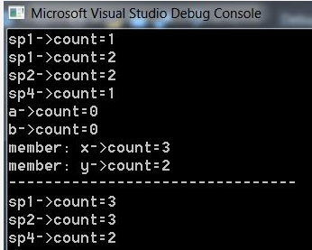
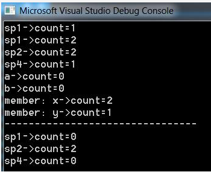
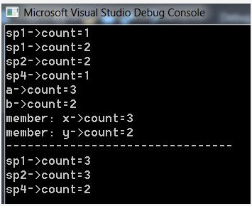

- [C++11 shared_ptr智能指针（超级详细）](c.biancheng.net/view/7898.html) ---- 基本概念通俗易懂

- [c++是否应避免使用普通指针，而使用智能指针（包括shared，unique，weak）？](https://www.zhihu.com/question/319277442) 
- - 讲的很好

- [c++ 11 的shared_ptr多线程安全？](https://www.zhihu.com/question/56836057)

- [shared_ptr in cppreference.com](https://en.cppreference.com/w/cpp/memory/shared_ptr#:~:text=A%20shared_ptr%20can%20share%20ownership%20of%20an%20object,get%20%28%29%2C%20the%20dereference%20and%20the%20comparison%20operators.)

- [深入理解C++11：C++11新特性解析与应用（书籍](https://www.zhihu.com/topic/20838390/hot)

- [智能指针shared_ptr基本用法和原理](https://blog.csdn.net/bandaoyu/article/details/107133606)

## C++11/14之STD::SHARED_PTR作为引用参数，普通参数
1. c++中使用std::shared_ptr类型做为构造函数参数，并使用std::move()初始化成员变量。
使用std::shared_ptr类型作为形参，shared_ptr会被复制，使用std::move()之后，形参对象就没有内容了。

```cpp
#include <iostream>
#include <utility>
#include <memory>
 
class Base
{
public:
    Base(std::shared_ptr<int> a, std::shared_ptr<int> b)
        : x{ std::move(a) }
        , y{ std::move(b) }
    {
        std::cout << "a->count=" << a.use_count() << std::endl;
        std::cout << "b->count=" << b.use_count() << std::endl;
    }
 
    void display()
    {
        std::cout << "member: x->count=" << x.use_count() << std::endl;
        std::cout << "member: y->count=" << y.use_count() << std::endl;
        std::cout << "--------------------------------" << std::endl;
    }
private:
    std::shared_ptr<int> x;
    std::shared_ptr<int> y;
};
 
int main(void)
{
    auto sp1 = std::make_shared<int>(111);
    std::cout << "sp1->count=" << sp1.use_count() << std::endl;
    decltype(sp1) sp2 = sp1;
    std::cout << "sp1->count=" << sp1.use_count() << std::endl;
    std::cout << "sp2->count=" << sp2.use_count() << std::endl;
    auto sp4 = std::make_shared<int>(444);
    std::cout << "sp4->count=" << sp4.use_count() << std::endl;
    Base b(sp1, sp4);
    b.display();
    std::cout << "sp1->count=" << sp1.use_count() << std::endl;
    std::cout << "sp2->count=" << sp2.use_count() << std::endl;
    std::cout << "sp4->count=" << sp4.use_count() << std::endl;
 
    return 0;
}
```
结果如下：



2. c++中使用std::shared_ptr类型做为构造函数参数，并直接初始化成员变量。

使用std::shared_ptr类型作为形参，shared_ptr会被复制，使用初始化复制之后，又相当于复制了一份shared_ptr。
```cpp
#include <iostream>
#include <utility>
#include <memory>
 
class Base
{
public:
    Base(std::shared_ptr<int> a, std::shared_ptr<int> b)
        : x{ a }
        , y{ b }
    {
        std::cout << "a->count=" << a.use_count() << std::endl;
        std::cout << "b->count=" << b.use_count() << std::endl;
    }
 
    void display()
    {
        std::cout << "member: x->count=" << x.use_count() << std::endl;
        std::cout << "member: y->count=" << y.use_count() << std::endl;
        std::cout << "--------------------------------" << std::endl;
    }
private:
    std::shared_ptr<int> x;
    std::shared_ptr<int> y;
};
 
int main(void)
{
    auto sp1 = std::make_shared<int>(111);
    std::cout << "sp1->count=" << sp1.use_count() << std::endl;
    decltype(sp1) sp2 = sp1;
    std::cout << "sp1->count=" << sp1.use_count() << std::endl;
    std::cout << "sp2->count=" << sp2.use_count() << std::endl;
    auto sp4 = std::make_shared<int>(444);
    std::cout << "sp4->count=" << sp4.use_count() << std::endl;
    Base b(sp1, sp4);
    b.display();
    std::cout << "sp1->count=" << sp1.use_count() << std::endl;
    std::cout << "sp2->count=" << sp2.use_count() << std::endl;
    std::cout << "sp4->count=" << sp4.use_count() << std::endl;
 
    return 0;
}
```
 结果如下：


3. c++中使用std::shared_ptr通过引用的方式做为构造函数参数，并使用std::move()初始化成员变量。

使用std::shared_ptr类型引用作为形参，shared_ptr就不会被复制，使用std::move()之后，形参对象就没有内容了。
```cpp
#include <iostream>
#include <utility>
#include <memory>
 
class Base
{
public:
      Base(std::shared_ptr<int>& a, std::shared_ptr<int>& b)
          : x{ std::move(a) }
          , y{ std::move(b) }
    {
        std::cout << "a->count=" << a.use_count() << std::endl;
        std::cout << "b->count=" << b.use_count() << std::endl;
    }
 
    void display()
    {
        std::cout << "member: x->count=" << x.use_count() << std::endl;
        std::cout << "member: y->count=" << y.use_count() << std::endl;
        std::cout << "--------------------------------" << std::endl;
    }
private:
    std::shared_ptr<int> x;
    std::shared_ptr<int> y;
};
 
int main(void)
{
    auto sp1 = std::make_shared<int>(111);
    std::cout << "sp1->count=" << sp1.use_count() << std::endl;
    decltype(sp1) sp2 = sp1;
    std::cout << "sp1->count=" << sp1.use_count() << std::endl;
    std::cout << "sp2->count=" << sp2.use_count() << std::endl;
    auto sp4 = std::make_shared<int>(444);
    std::cout << "sp4->count=" << sp4.use_count() << std::endl;
    Base b(sp1, sp4);
    b.display();
    std::cout << "sp1->count=" << sp1.use_count() << std::endl;
    std::cout << "sp2->count=" << sp2.use_count() << std::endl;
    std::cout << "sp4->count=" << sp4.use_count() << std::endl;
 
    return 0;
}
```
结果如下：



4. c++中使用std::shared_ptr通过引用的方式做为构造函数参数，并直接初始化成员变量。

使用std::shared_ptr类型引用作为形参，shared_ptr就不会被复制，使用初始化复制之后，又相当于复制了一份shared_ptr。
```cpp
#include <iostream>
#include <utility>
#include <memory>
 
class Base
{
public:
    Base(std::shared_ptr<int>& a, std::shared_ptr<int>& b)
        : x{ a }
        , y{ b }
    {
        std::cout << "a->count=" << a.use_count() << std::endl;
        std::cout << "b->count=" << b.use_count() << std::endl;
    }
 
    void display()
    {
        std::cout << "member: x->count=" << x.use_count() << std::endl;
        std::cout << "member: y->count=" << y.use_count() << std::endl;
        std::cout << "--------------------------------" << std::endl;
    }
private:
    std::shared_ptr<int> x;
    std::shared_ptr<int> y;
};
 
int main(void)
{
    auto sp1 = std::make_shared<int>(111);
    std::cout << "sp1->count=" << sp1.use_count() << std::endl;
    decltype(sp1) sp2 = sp1;
    std::cout << "sp1->count=" << sp1.use_count() << std::endl;
    std::cout << "sp2->count=" << sp2.use_count() << std::endl;
    auto sp4 = std::make_shared<int>(444);
    std::cout << "sp4->count=" << sp4.use_count() << std::endl;
    Base b(sp1, sp4);
    b.display();
    std::cout << "sp1->count=" << sp1.use_count() << std::endl;
    std::cout << "sp2->count=" << sp2.use_count() << std::endl;
    std::cout << "sp4->count=" << sp4.use_count() << std::endl;
 
    return 0;
}
```
结果如下：



