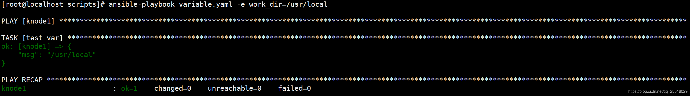

ansible-playbook定义变量与使用
1. ansible-playbook变量定义与使用

命令行
在Inventory中定义
在Playbook中定义
在Role中定义
注册变量（register）
系统信息变量（facts）
2. 在命令行中定义变量
  2.1) 案例编写playbook中定义，变量命令行传参
```shell
[root@localhost ~]# cat variable.yaml 
---
- hosts: web1
  gather_facts: no
  remote_user: root
 
 
  tasks:
  - name: test var
    debug: msg="{{work_dir}}"
```
  2.2) 执行playbook变量命令传参



  3. 在inventory中定义变量
    是在通过hosts文件里定义变量
```yml
[WebServer]
app[01:03].enterprising.cloud
 
[DB]
db-[a:c].enterprising.cloud
 
192.168.126.[131:133]
```

4. 在Playbook中定义变量
  4.1）编写Playbook定义变量
```shell
 1 [root@test-1 bin]# vim playbook.yaml 
 2 [root@test-1 bin]# cat playbook.yaml 
 3 ---
 4 - hosts: web1
 5   gather_facts: no
 6   remote_user: root
 7   vars: 
 8     - work_dir: /usr/local
 9     - nginx_version: 1.15
10 
11   tasks:
12   - name: install nginx
13     debug: msg="{{work_dir}}/nginx/{{nginx_version}}"
```
  4.2) 执行playbook配置文件语法检测
```
1 [root@test-1 bin]# ansible-playbook --syntax-check playbook.yaml 
2 
3 playbook: playbook.yaml
```
  4.3) 执行playbook变量文件传参
```shell
 1 [root@test-1 bin]# ansible-playbook  playbook.yaml 
 2 
 3 PLAY [web1] ************************************************************************************************************************************
 4 
 5 TASK [install nginx] ***************************************************************************************************************************
 6 ok: [192.168.200.132] => {
 7     "msg": "/usr/local/nginx/1.15"
 8 }
 9 ok: [192.168.200.133] => {
10     "msg": "/usr/local/nginx/1.15"
11 }
12 
13 PLAY RECAP *************************************************************************************************************************************
14 192.168.200.132            : ok=1    changed=0    unreachable=0    failed=0    skipped=0    rescued=0    ignored=0   
15 192.168.200.133            : ok=1    changed=0    unreachable=0    failed=0    skipped=0    rescued=0    ignored=0  
```
5. 在Role中定义
```shell
1 [root@test-1 vars]# vim /ansible/roles/nginx/vars/main.yaml 
2 [root@test-1 vars]# cat /ansible/roles/nginx/vars/main.yaml 
3 ---
4 #nginx
5 nginx_version: 1.16.1
6 http_port: 80
7 server_name: test-www.scajy.cn
```
6. 注册变量（register）
  6.1）编写register注册变量
```shell
 1 [root@test-1 bin]# vim register.yaml 
 2 [root@test-1 bin]# cat register.yaml 
 3 ---
 4 - hosts: web1
 5   gather_facts: no
 6   remote_user: root
 7   vars:
 8     - work_dir: /usr/local
 9     - nginx_version: 1.15.1
10 
11   tasks:
12   - name: register var
13     command: date +"%F_%T"
14     register: datetime
15 
16   - name: touch file
17     file:
18       dest: /tmp/r_{{datetime.stdout}}
19       state: touch
```
 6.2) 检查语法是否错误
```shell
1 [root@test-1 bin]# ansible-playbook --syntax-check register.yaml 
2 
3 playbook: register.yaml
```
  6.3) 执行register配置文件
```shell
 1 [root@test-1 bin]# ansible-playbook register.yaml 
 2 
 3 PLAY [web1] ************************************************************************************************************************************
 4 
 5 TASK [register var] ****************************************************************************************************************************
 6 changed: [192.168.200.133]
 7 changed: [192.168.200.132]
 8 
 9 TASK [touch file] ******************************************************************************************************************************
10 changed: [192.168.200.133]
11 changed: [192.168.200.132]
12 
13 PLAY RECAP *************************************************************************************************************************************
14 192.168.200.132            : ok=2    changed=2    unreachable=0    failed=0    skipped=0    rescued=0    ignored=0   
15 192.168.200.133            : ok=2    changed=2    unreachable=0    failed=0    skipped=0    rescued=0    ignored=0  
``` 
  6.4) 验证tmp下是否创建了文件

7. 系统信息变量（facts）
```yml
1 ---
2 - hosts：webservers
3   tasks：
4     - debug：
5       msg: {{group_names}}                     #打印ansible的host组
6     - debug：
7       msg: {{inventory_hostname}}              #打印详细的host主机
8     - debug:
9   msg: {{ansible_hostname}}                    #配合gather_facts: yes     开启收集系统信息
```