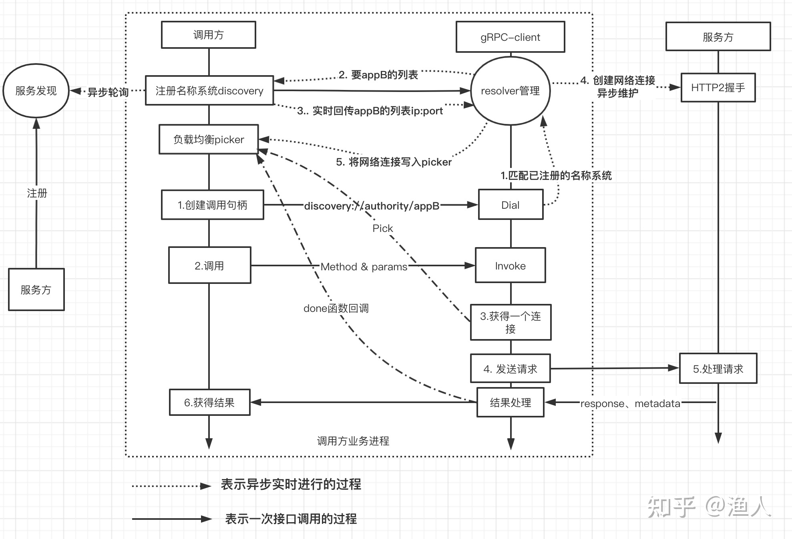

# gRPC

## 1. reference

- [Beating JSON performance with Protobuf](https://auth0.com/blog/beating-json-performance-with-protobuf/)

- [Protocol Buffer Basics: C++](https://developers.google.com/protocol-buffers/docs/cpptutorial)

- [gRPC – An RPC library and framework](https://github.com/grpc/grpc)

- [DocsLanguagesC++](https://grpc.io/docs/languages/cpp/)

- [gRPC examples](https://github.com/grpc/grpc/tree/master/examples/cpp)

- [gRPC系列(一) 什么是RPC？- 知乎](https://zhuanlan.zhihu.com/p/148139089)

- [gRPC系列(二) 如何用Protobuf组织内容](https://zhuanlan.zhihu.com/p/149821222)

- [gRPC系列(三) 如何借助HTTP2实现传输](https://zhuanlan.zhihu.com/p/161577635)

- [gRPC系列(四) 框架如何赋能分布式系统](https://zhuanlan.zhihu.com/p/344914169)

- [grpc官方文档英文版](https://grpc.io/docs/)

- [grpc官方文档中文版](https://doc.oschina.net/grpc)

- [grpc-我们为什么要用gRpc？gRpc快在哪里？](https://zhuanlan.zhihu.com/p/377860784)

- [为什么对gRPC做负载均衡会很棘手？](https://zhuanlan.zhihu.com/p/349734892)

- [gRPC服务发现&负载均衡](https://zhuanlan.zhihu.com/p/164834099)

- [golang 使用 gRPC](https://zhuanlan.zhihu.com/p/161473581)