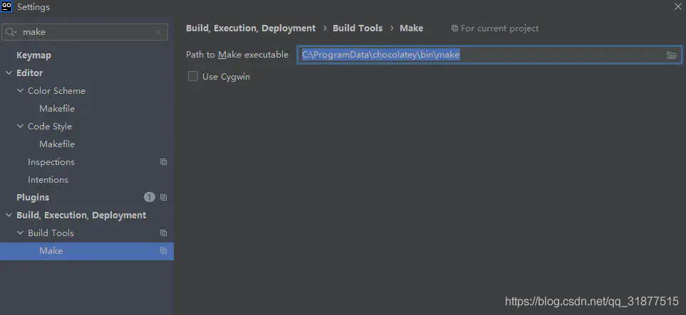

# [Download](https://golang.google.cn/dl/)

# [golang 2022.1永久激活](http://www.javatiku.cn/goland/1429.html) 

- [Go 语言到底适合干什么？](https://www.zhihu.com/question/296426314)

- [GOLANG HTTPS SERVER](https://www.freesion.com/article/8416588126/)

- [go语言启动一个http服务](https://blog.csdn.net/weixin_38361347/article/details/121893192)

- [golang http2 client 和server 使用非TLS 模式(h2c)](https://www.jianshu.com/p/ff16b0308e7c)

- [HTTP/2 and TLS client and server example with Golang](www.inanzzz.com/index.php/post/9ats/http2-and-tls-client-and-server-example-with-golang)

- [Go发起HTTP2.0请求流程分析(前篇)](https://segmentfault.com/a/1190000037438011)

- [Go 语言 HTTP/2 探险之旅](https://www.infoq.cn/article/vibfhhmpf7hmnnw4fhrx)

- [golang http2长链接](https://studygolang.com/articles/29560)

- [Go http2 和 h2c](https://colobu.com/2018/09/06/Go-http2-和-h2c/)

- [go安装包下载](https://studygolang.com/dl)

- [Centos 安装 golang]()

```shell
cd /usr/local

wget https://studygolang.com/dl/golang/go1.19.linux-amd64.tar.gz

tar -C /usr/local -zxf go1.19.linux-amd64.tar.gz

vim /etc/profile

在文件后追加以下内容
export GOPROXY=https://goproxy.cn
export GOROOT=/usr/local/go
export PATH=$PATH:$GOROOT/bin
export GOPATH=/root/go
export PATH=$PATH:$GOPATH/BIN

退出并保存，刷新环境变量
source /etc/profile

go --version
```

## Windows下使用syscall.SIGUSR1报错：SIGUSR1 not declared by package syscall
在 go 的安装目录修改 Go\src\syscall\types_windows.go，增加如下代码：
```go
var signals = [...]string{
    // 这里省略N行。。。。
 
    /** 兼容windows start */
    16: "SIGUSR1",
    17: "SIGUSR2",
    18: "SIGTSTP",
    /** 兼容windows end */
}
 
/** 兼容windows start */
func Kill(...interface{}) {
    return;
}
const (
    SIGUSR1 = Signal(0x10)
    SIGUSR2 = Signal(0x11)
    SIGTSTP = Signal(0x12)
)
/** 兼容windows end */
```
# go mod init

# GOPROXY=https://goproxy.cn,direct

- [Go 语言到底适合干什么？](https://www.zhihu.com/question/296426314)

- [golang http2 client 和server 使用非TLS 模式(h2c)](https://www.jianshu.com/p/ff16b0308e7c)

- [Go 语言中文开源图书、资料或文档](books.studygolang.com)

- [Go菜鸟教程](https://www.runoob.com/go/go-constants.html)

- [在goland下使用makefile](https://blog.csdn.net/qq_31877515/article/details/117131494)

```shell
    Set-ExecutionPolicy Bypass -Scope Process -Force; iex ((New-Object System.Net.WebClient).DownloadString('https://chocolatey.org/install.ps1'))
    choco
    choco install make
```


- [Golang+Vue构建全功能Web应用](https://blog.csdn.net/u012986012/article/details/122667314)
- - [JerryBluesnow/ming](https://github.com/JerryBluesnow/ming)
- - [qingwave/weave](https://github.com/qingwave/weave)

- [GitHub Top 10 + Go 语言开源项目（2021版）](https://zhuanlan.zhihu.com/p/407882351)

- [GitHub Top 10 + Vue 开源项目（2021版)](https://zhuanlan.zhihu.com/p/409241661)

- [高并发微服务网关设计与实现](https://zhuanlan.zhihu.com/p/387378721)
