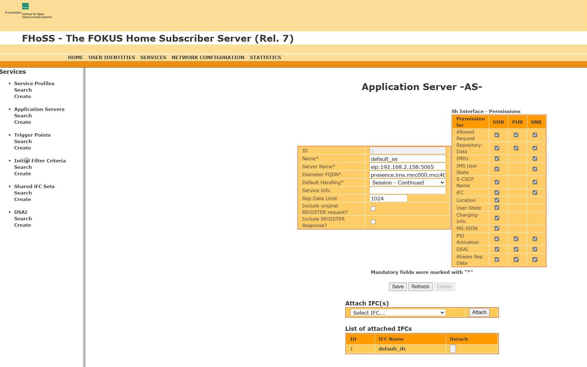
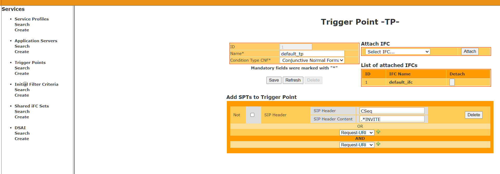
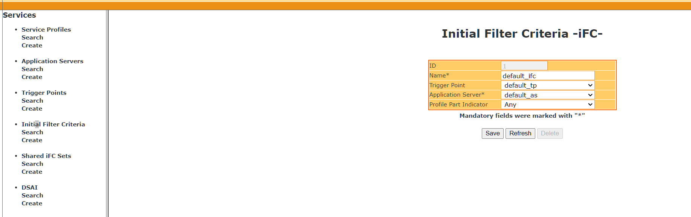
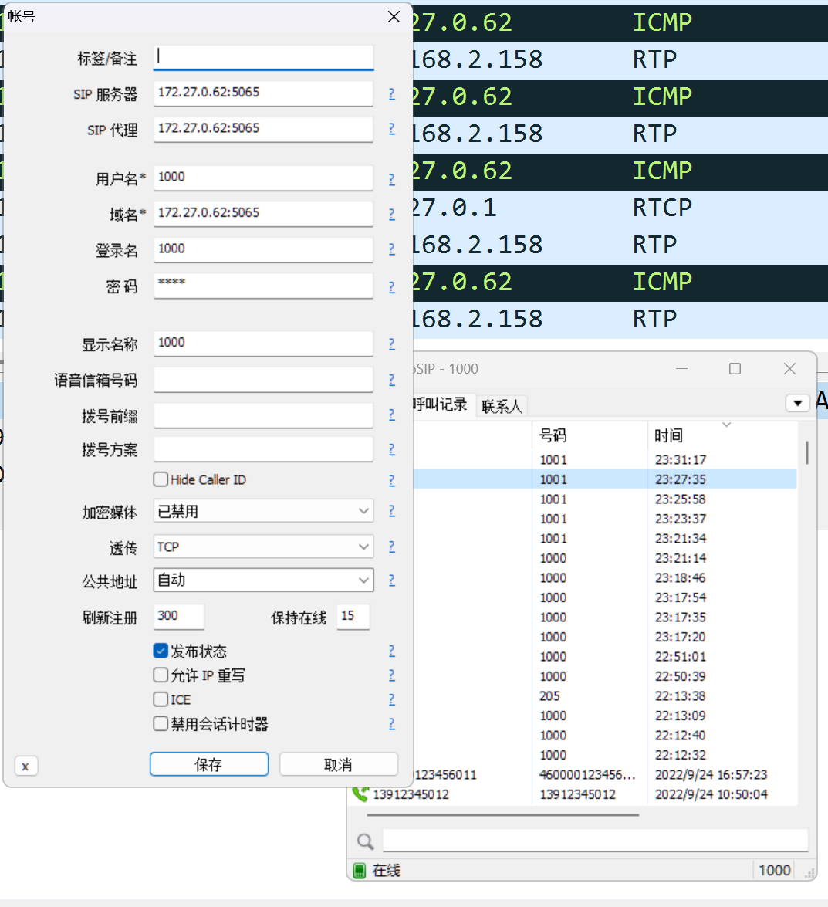
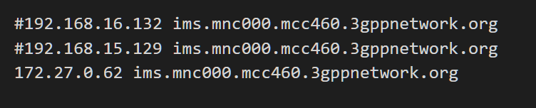

- [Freeswitch Download](https://files.freeswitch.org/windows/installer/x64/)

- [FreeSWITCH在呼叫失败的情况下如何播放语音提示-Jerry 参考](http://www.dujinfang.com/2013/01/10/freeswitch-zai-hu-jiao-shi-bai-de-qing-kuang-xia-ru-he-bo-fang-yu-yin-ti-shi.html)

- [SIPp测试freeswitch用户注册](https://www.cnblogs.com/yjmyzz/p/sipp-authentication.html)

- [FreeSWITCH分机忙处理](https://www.cnblogs.com/hezhixiong/p/8487598.html)

- [freeswitch笔记(2)-voip初体验](https://www.cnblogs.com/yjmyzz/p/zoiper-and-yateclient-turotial.html)

- [【FreeSwitch开发实践】专栏简介](https://xiao2macf.blog.csdn.net/article/details/125951053)

- [centos7 安装freeswitch](t.zoukankan.com/allen-zhang-p-11797876.html)

- https://github.com/nickvsnetworking/FreeSWITCH_AMR_Codec/blob/master/Dockerfile

- [公网Kamailio 代理 freeswitch 和做 sbc](https://blog.csdn.net/Java_lilin/article/details/108882310)

- [unimrcp-voice-activity语音检测](https://www.cnblogs.com/damizhou/p/11308236.html)

https://blog.csdn.net/gxxzx/article/details/79468981

事件列表

https://freeswitch.org/confluence/display/FREESWITCH/Event+List

https://blog.csdn.net/gxxzx/article/details/87343583

http://www.freeswitch.org.cn/2010/04/30/freeswitch-zhong-wen-wen-dang.html

https://docs.freeswitch.org/modules.html


http://www.voidcn.com/tag/FreeSwitch/list-2.html

 FreeSWITCH权威指南权威指南 PDF

 https://www.taodocs.com/p-57877624.html


客户端内存溢出

https://shelu.net/outofmemoryerror-from-freeswitch-esl-client/


http://www.voidcn.com/article/p-exyuatat-bpb.html


- [一个关于freeswitch的公开教程](https://zhuanlan.zhihu.com/p/451981734)

- [voipmaker](https://blog.csdn.net/voipmaker)

- [freeswitch系列二 kamailio 5.0安装及实现kamailio集成freeswitch](https://blog.csdn.net/hry2015/article/details/77338341)

- [OpenIMSCore的搭建过程-application server](https://www.likecs.com/show-204197680.html)




- [freeSWITCH从0开始搭建记录- sipjs 完整能打电话](https://juejin.cn/post/7021092627030376478)

- [手把手教你部署验证freeswitch（避免踩坑）](https://blog.csdn.net/springhub/article/details/117047308)

- [《FreeSWITCH: VoIP实战》：SIP 模块 - mod_sofia](www.ctiforum.com/news/guandian/330988.html)

- [FreeSWITCH中文网,电话机器人开发网](freeswitch.net.cn/201509.html)

## freeswitch测试container: vonrconftest2

### 记录手动编译安装freeswitch 

- [FreeSWITCH 安装配置的 各种坑, 填坑](https://www.cnblogs.com/lzpong/p/6740188.html)
- [流媒体服务器FreeSWITCH的安装、配置与启动](https://blog.csdn.net/TangVim/article/details/88235050?utm_medium=distribute.pc_relevant.none-task-blog-2~default~baidujs_baidulandingword~default-5-88235050-blog-106893293.t5_download_comparev1&spm=1001.2101.3001.4242.4&utm_relevant_index=7)
- [centos.pkgs.org](https://centos.pkgs.org/7/centos-x86_64/nss-3.44.0-7.el7_7.i686.rpm.html)

```shell
#FreeSWITCH with AMR Support (BYO Licencing)
FROM debian:buster-slim

RUN apt-get update && apt-get install -yq gnupg2 wget lsb-release vim tcpdump sngrep
RUN wget -O - https://files.freeswitch.org/repo/deb/debian-release/fsstretch-archive-keyring.asc | apt-key add -
RUN echo "deb http://files.freeswitch.org/repo/deb/debian-release/ `lsb_release -sc` main" > /etc/apt/sources.list.d/freeswitch.list
RUN echo "deb-src http://files.freeswitch.org/repo/deb/debian-release/ `lsb_release -sc` main" >> /etc/apt/sources.list.d/freeswitch.list
RUN apt-get update

# # Install dependencies required for the build
#Install OpenJRE first because Java is a jerk
RUN mkdir -p /usr/share/man/man1
RUN apt-get install openjdk-11-jre-headless:amd64 -y
RUN apt-get build-dep freeswitch -y

WORKDIR /usr/src/

#Install Opencore-AMR
RUN apt-get install libopencore-amrwb-dev libopencore-amrwb0 libopencore-amrwb0-dbg libvo-amrwbenc-dev libvo-amrwbenc0 vo-amrwbenc-dbg

# # then let's get the source. Use the -b flag to get a specific branch
WORKDIR /usr/src/
RUN git clone https://github.com/signalwire/freeswitch.git -bv1.10 freeswitch
WORKDIR /usr/src/freeswitch
RUN git config pull.rebase true
#Copy over AMR files
RUN cp /usr/include/opencore-amrnb/interf_enc.h /usr/src/freeswitch/src/mod/codecs/mod_amr/
RUN cp /usr/include/opencore-amrnb/interf_dec.h /usr/src/freeswitch/src/mod/codecs/mod_amr/
RUN cp /usr/include/opencore-amrwb/dec_if.h  /usr/src/freeswitch/src/mod/codecs/mod_amrwb/
RUN cp /usr/include/vo-amrwbenc/enc_if.h /usr/src/freeswitch/src/mod/codecs/mod_amrwb/

RUN ./bootstrap.sh -j

#Add AMR WB to modules list
RUN sed -i '/#codecs\/mod_amrwb/s/^#//g' modules.conf

RUN ./configure
RUN make
RUN make install

#Add sounds
RUN make cd-sounds-install cd-moh-install

CMD ["/usr/local/freeswitch/bin/freeswitch"]
```
### freeswitch安装方法1 in CENTOS7.6

```shell
echo "signalwire" > /etc/yum/vars/signalwireusername

echo "pat_1X8EQXH6EvgajWaBVWSJCG51"> /etc/yum/vars/signalwiretoken

替换为阿里云，163部分源出现了连不上的现象
cp /etc/yum.repos.d/CentOS-Base.repo /etc/yum.repos.d/CentOS-Base.repo.bak

curl -o /etc/yum.repos.d/CentOS-Base.repo http://mirrors.aliyun.com/repo/Centos-7.repo

yum clean all;sudo yum makecache

rpm -ivh http://dl.fedoraproject.org/pub/epel/epel-release-latest-7.noarch.rpm

yum install -y https://$(< /etc/yum/vars/signalwireusername):$(< /etc/yum/vars/signalwiretoken)@freeswitch.signalwire.com/repo/yum/centos-release/freeswitch-release-repo-0-1.noarch.rpm

yum install -y freeswitch-config-vanilla freeswitch-lang-* freeswitch-sounds-*

启动关闭
systemctl start freeswitch

systemctl status freeswitch

systemctl stop freeswitch

```

## UniMRCP
- [UniMRCP gitee](https://gitee.com/mirrors/UniMRCP/)
- [智能电话机器人--基于 UniMRCP 实现讯飞 ASR MRCP Server](https://www.likecs.com/show-204412328.html)
```
什是 MRCP
媒体资源控制协议（Media Resource Control Protocol, MRCP）是一种通讯协议，用于媒体资源服务器向客户端提供各种语音服务，目前已定义的媒体资源服务有语音识别(Speech Recognition)、语音合成(Speech Synthesis)、录音(Recording)、说话人鉴别和确认(Speaker Verification and Identifi-cation)。MRCP并不定义会话连接，不关心服务器与客户端是如何连接的，MRCP消息使用RTSP、SIP等作为控制协议，目前最新的MRCPv2版本使用SIP控制协议。（本文使用的是MRCPv2）。
```
```shell
INTRODUCTION
============

UniMRCP is an open source project compliant with the IETF RFC6787 (MRCPv2) and RFC4463 (MRCPv1)
specifications.


INSTALLATION
============

See the file "INSTALL" for installation tips.


DOCUMENTATION
=============

Use the directory "docs/dox" for a documentation generated by Doxygen.
Use the directory "docs/ea" for UML based design concepts, HTML pages generated by Enterprise Architect.

REFERENCES
==========

Website:
   http://www.unimrcp.org

Downloads:
   http://www.unimrcp.org/downloads

Documentation:
   http://www.
```

https://files.freeswitch.org/freeswitch-release-1-6.noarch.rpm

https://files.freeswitch.org/

- [官方安装](https://freeswitch.org/confluence/display/FREESWITCH/CentOS+7+and+RHEL+7)

wget --http-user=signalwire --http-password=pat_1X8EQXH6EvgajWaBVWSJCG51 -O /usr/share/keyrings/signalwire-freeswitch-repo.gpg https://freeswitch.signalwire.com/repo/deb/debian-release/signalwire-freeswitch-repo.gpg

- [CentOS下安装libjpeg库及编译GD库](http://t.zoukankan.com/vania-p-10383964.html)

## 注册打电话

MicroSIP注册到freeswitch，port 5065. microsip配置如下



windows hosts文件如下：




- [sipp学习笔记](https://www.cnblogs.com/yjmyzz/p/sipp-tutorial.html)

## 配置外部电话呼入sip软电话
- [refer](https://blog.csdn.net/weixin_43439748/article/details/116454265)
外部电话呼入需要购买带有FXO端口的硬件设备，具体连接配置方式参照硬件供应商提供的产品说明(后文以讯时网关为例说明)

外部电话信号转发至FreeSwitch平台后需要配置拨号计划。具体配置如下：

进入文件目录
#cd /usr/local/freeswitch/conf/dialplan/
1
dialplan文件夹说明
#ls
default  default.xml  features.xml  public  public.xml  skinny-patterns  skinny-patterns.xml
default.xml和public.xml分别是内部拨号规则和对外拨号规则的配置。

电话信号从外部进入Freeswitch平台，使用public.xml文件配置信息。新增配置信息直接在public文件夹新建xml文件即可自动加载
[root@localhost public]# cat 00_inbound_did.xml
```xml
<include>
  <extension name="public_did">
        <!-- 12345678 为电话局端为你分配的电话号码 -->
    <condition field="destination_number" expression="^(12345678)$">

      	<action application="set" data="domain_name=$${domain}"/>
   <!-- 1.指定坐席 电话转接至 账号1001 坐席 -->
     	<action application="transfer" data="1001 XML "/>
   <!-- 2.配置静态坐席 坐席也可动态迁入迁出-->
   		<!-- 
        <action application="set" data="fifo_music=$${hold_music}"/> 
        <action application="fifo" data="my_fifo in"/>   
        -->
   <!-- 3.配置ivr流程 -->
		<!--        
        <action application="answer" data=""/>
        <action application="seleep" data="100"/>
        <action application="ivr" data="new_demo_ivr"/> 
		-->
  </condition>
  </extension>
</include>
```
## 小技巧---FreeSWITCH在多张网卡的情况下指定IP
很多同学问，在FreeSWITCH有多张网卡的情况下怎么指定走哪一张。其实，FreeSWITCH是不知道网卡的，只知道IP。FreeSWITCH在启动时会自己选一个它认为最靠谱的IP（一般是能上互联网的那一个）做为默认的IP，这个IP就体现在 local_ip_v4 这个通道变量。那如果你想使用另外的网卡做为默认的IP呢？最简单的办法就是在vars.xml里加上一行，手动指定local_ip_v4。
```xml
 <X-PRE-PROCESS cmd="set" data=“local_ip_v4=192.168.3.119"/>
 <X-PRE-PROCESS cmd="set"data="domain=$${local_ip_v4}"/>
```

## 按 F8 键将 log 级别设置为 DEBUG
## freeswitch 事件调试
2021-06-07 16:40:51
1. SIP 信令跟踪
在 fs_cli 里输入以下命令，可以激活SIP信令跟踪:

sofia loglevel all 9
sofia global siptrace on 
2. 设置Log 等级
编辑console.conf.xml
```xml
<param name="log_event" value="DEBUG"/> 
<param name="all" value="DEBUG"/>
```
编辑switch.conf.xml 

```xml
<param name="loglevel" value="debug"/>
```
配置中的日志等级表：

0 "CONSOLE",
1 "ALERT",
2 "CRIT",
3 "ERR",
4 "WARNING",
5 "NOTICE",
6 "INFO",
7 "DEBUG"


还可以通过控制台API动态设置log 输出级别：

freeswitch@de> console loglevel [0-7] 
此外，还可以设置 fsctl的log级别：

freeswitch@de> fsctl loglevel [0-7] 
如果是通过fs_cli连接，那么上述命令不会生效。这时应该用/log <loglevel>命令来控制日志的输出级别。


3. 输出的颜色
在console.conf.xml 里，可以打开控制台输出的高亮开关。

```xml
<!-- comment or set to false for no color logging -->
<param name="colorize" value="true"/>
```
颜色方案：

ALER - Red
CRIT - Red
ERROR - Red
WARNING - Magenta
NOTICE - Cyan
INFO - Green
DEBUG - Yellow


## sofia.c:8034 IP 42.96.203.28 Rejected by acl "domains". Falling back to Digest auth.
- [Freeswitch与外域IP对接之incoming call（彻底解决Rejected by acl "domains". Falling back to Digest auth.）](https://blog.csdn.net/xuyunzhang/article/details/28097929)
修改/usr/local/freeswitch/conf/autoload_configs/acl.conf.xml：
```xml
<configuration>
     ......
    <list name="domains" default="deny">
      <!-- domain= is special it scans the domain from the directory to build the ACL -->
      <node type="allow" domain="$${domain}"/>
      <!-- Added by vinco zhang at 2014-06-01 for zhangwenge gateway -->
      <!--  why domain="42.96.203.28" doesn't work ? --> 
      <!-- <node type="allow" domain="42.96.203.28"/> -->
      <!-- use cidr= if you wish to allow ip ranges to this domains acl. -->
      <!-- <node type="allow" cidr="192.168.0.0/24"/> -->
     <!-- Added by vinco zhang at 2014-06-01 for zhangwenge gateway -->
      <node type="allow" cidr="192.168.2.0/24"/>
    </list>
  </network-lists>
</configuration>
```

acl配置生效

freeswitch@internal> reloadacl reloadxml

## FreeSwitch中用户不经过认证即可注册成功
一般来说，FreeSwitch中的SIP 用户都需要通过用户名和密码进行认证后才能注册成功，并进行通话。若有特殊需要，也可以设置为无认证即可使用，具体设置如下 ：

打开 /usr/local/freeswitch/conf/sip_profiles/internal.xml ,将如下两条设置去掉注释即可，
```xml
<!– <param name="accept-blind-auth" value="true"/> –>
<!– <param name="suppress-cng" value="true"/> –>
```
即：
```xml
<param name="accept-blind-auth" value="true"/>
<param name="suppress-cng" value="true"/>
```

在 FS_CLI.exe 中运行 reloadxml 即可。

## 配置IP地址
这一步主要是解决，拨号成功之不然可能打得通电话，但是没有声音。
cd sip_profiles
复制代码
找到external.xml和internal.xml文件，将value字段修改为公网的IP地址，没公网写内网的
```xml
<param name="ext-rtp-ip" value="[external_ip]"/>
<param name="ext-sip-ip" value="[external_ip]"/>
```
复制代码
改后
```xml
<param name="ext-rtp-ip" value="192.168.2.158"/>
<param name="ext-sip-ip" value="192.168.2.158"/>
```

## /usr/local/freeswitch/conf/vars.xml

```xml
  <!-- Internal SIP Profile -->
  <X-PRE-PROCESS cmd="set" data="internal_auth_calls=false"/>
  <X-PRE-PROCESS cmd="set" data="internal_sip_port=5065"/>
  <X-PRE-PROCESS cmd="set" data="internal_tls_port=5055"/>
  <X-PRE-PROCESS cmd="set" data="internal_ssl_enable=false"/>

  <!-- External SIP Profile -->
  <X-PRE-PROCESS cmd="set" data="external_auth_calls=false"/>
  <X-PRE-PROCESS cmd="set" data="external_sip_port=5080"/>
  <X-PRE-PROCESS cmd="set" data="external_tls_port=5081"/>
  <X-PRE-PROCESS cmd="set" data="external_ssl_enable=false"/>
```

- [VoLTE IMS会话建立流程 N5流程](https://zhuanlan.zhihu.com/p/372452698)

- [VoLTE Series](https://www.telecomtutorial.info/blog/categories/volte-series)

## 本地用户拨打外部号码流程
本地user/1000拨打外部号码40012345：

因为user/1000注册在5060端口，所以向fs的5060端口发送INVITE请求；
INVITE请求到达internal这个Profile所配置的UA（internal.xml）；
此UA会对此INVITE请求进行鉴权（因为auth-calls=ture）；
先检查ACL(acl.conf.xml)，然后进行Digest鉴权(directory/default/1000.xml中的用户名和密码)；
若鉴权通过后会找到该用户的配置文件（即1000.xml），在1000.xml中的user_context标签中配置了路由，所以fs会根据此配置进行路由查找：以默认配置为例：，此时进入diaplan/default.xml中寻找路由；
对于外部号码，default.xml中一般会将请求送到外部网关，例如：bridge sofia/gateway/gw1/40012345这样；
其中gw1是我们配置的一个网关。本文开头解释过，网关最终都会被装入external.xml，而external这个Profile运行在5080端口。因此，该INVITE请求最终会通过本机的5080端口发往gw1网关（在gw1对应的xml中配好了目的地的ip和端口）。

作者：阿虎儿
链接：https://juejin.cn/post/7021092627030376478
来源：稀土掘金
著作权归作者所有。商业转载请联系作者获得授权，非商业转载请注明出处。

## freeswitch软电话配置、结合讯时网关，外线电话呼入、呼出配置

## 通过这种方式:originate sofia/external/1000@192.168.2.148 &echo 可以呼叫成功
但是 originate user/1000 &echo 却不可以

originate sofia/external/460000123456011@ims.mnc000.mcc460.3gppnetwork.org:6060 &echo


## 最快安装（推荐）
wget http://www.freeswitch.org/eg/Makefile && make install

以上命令会下载一个 Makefile，然后使用 make 执行安装过程。安装过程中它会从 SVN 仓库中获取代码，实际上执行的操作跟上一种安装方式相同。

## 安装声音文件
```
make sounds-install
make moh-install
make cd-sounds-install
make cd-moh-install
```
## 电话

虽然 FreeSWITCH 支持 IAX、H323、Skype、Gtalk 等众多通信协议，但其最主要的协议还是 SIP。支持SIP的软电话有很多，最常用的是 X-Lite 和 Zoiper。这两款软电话都支持 Linux、MacOSX 和 Windows平台，免费使用但是不开源。在 Linux 上你还可以使用 ekiga 软电话。

## 特殊号码

激动人心的时刻就要来了。输入“9664”按回车（或按绿色拨打电话按钮），就应该能听到保持音乐(MOH, Music on Hold)。如果听不到也不要气馁，看一下 FS-Con 中有没有提示什么错误。如果有“File Not Found”之类的提示，多半是声音文件没有安装，重新查看 make moh-install 是否有错误。接下来，可以依次试试拨打以下号码：

| 号码      |   说明|
| ----------|----------|
| 9664      |   保持音乐 |
| 9196      |   echo，回音测试|
| 9195      |   echo，回音测试，延迟5秒|
| 9197      |   milliwatte extension，铃音生成|
| 9198      |   TGML 铃音生成示例|
| 5000      |   示例IVR|
| 4000      |   听取语音信箱|
| 33xx      |   电话会议，48K(其中xx可为00-99，下同)|
| 32xx      |   电话会议，32K|
| 31xx      |   电话会议，16K|
| 30xx      |   电话会议，8K|
| 2000-2002 |   呼叫组|
| 1000-1019 |   默认分机|

## 命令行打开siptrace
```
freeswitch> sofia profile internal siptrace on

freeswitch> sofia profile external siptrace on

也可以全局开关抓包

freeswitch> sofia global siptrace on/off

还可以开底层日志

freeswitch> sofia loglevel all 9

或者可以开某一类型的日志
sofia loglevel <all|default|tport|iptsec|nea|nta|nth_client|nth_server|n ua|soa| sresolv|stun> [0-9]
```

## 常用命令

启动：freeswitch
启动并后台运行：freeswitch -nc
进入客户端：fs_cli -H 127.0.0.1 -P 8021 -p password
退出客户端：/exit， /bye, /quit Ctrl+D
停止：freeswitch -stop
查询网关状态: sofia status profile local
重启网关: sofia profile local restart
查看freeswitch的端口情况：netstat -anp|grep freeswitch
使用fs_cli进行呼叫：originate user/1003 &echo 其中&echo会把听到的声音返回给发出者
音频编码部分设备不支持可以使用这个bgapi originate {absolute_codec_string=PCMU}user/1009 018162330576 xml default
reloadxml 重新加载xml文件
查看当前注册的用户数量：sofia status profile internal
查找文件夹：find / -name external -type d
复制文件到多个文件夹：echo a b c | xargs -n 1 cp -v ./gwl.xml
重新注册网关：sofia profile external register gw
ps -ef | grep freeswitch netstat -apn | grep 8021
开启sip消息显示 sofia global siptrace on
关闭sip消息显示 sofia global siptrace off

## originate命令实例解
originate命令用于从FreeSWITCH中向外发起一个呼叫，这个“外”就是用这里的呼叫字符串指定的。

- fs 可以同时拨打 两通电话
```
freeswitch> originate user/1000,user/1001 &echo
```

- 也可以 一通 呼不通，就打第二通：
```
freeswitch> originate user/1000|user/1001 &echo
```

- orginate后面可以接路由，路由走 dialplan，比如这个例子就是走了9196的路由。
```
freeswitch> originate user/1000 9196
```

- 可以指定 inline模式
```
freeswitch> originate user/1000 echo inline
```

- 对于xml格式的dialplan 可以指定context
```
freeswitch> originate user/1000 1001 XML public
```

- originate可以指定主叫号码：
```
freeswitch> originate user/1000 &echo XML default 'Seven Du' 7777
```

这样会更改From字段和Remote-Party-ID字段

- 可以设置超时时间，这个超时不是指对方不接听的超时，而是对方不回复100 Trying的超时时间，一般 表示 ip地址不可达。
```
freeswitch> originate sofia/internal/1000@192.168.100.100 &echo XML default 'Seven Du' 7777 10
```
- 在 FreeSWITCH发出INVITE消息后，由于没有收到100 Trying回复，于是 在1秒后重发INVITE消息，如果还收不到则于2秒、4秒后重发，由 于我们指定了10秒超时，因此该呼叫于10秒后失败，返回NO_ANSWER。

默认的originate命令是阻塞的，如果执行上述命令，则无法输入其 他命令或取消该呼叫。一般用bgapi避免阻塞。

originate呼叫参数里 允许设置通道变量，注意逗号什么的要转义。 其中，“^^”后面跟冒号表示以后要用冒号代替逗号（真是奇怪的替代方式）
```shell
freeswitch> originate {origination_caller_id_name='Seven Du', originatioin_caller_id_number=7777}user/1000 &echo

freeswitch> originate {absolute_codec_string=G729\,PCMU}user/1000 &echo

freeswitch> originate {absolute_codec_string=^^:G729:PCMU'}user/1000 &echo
```
- 也可以把不同的通道变量用大括号分开写：

```shell
freeswitch> originate {var1=1}{var=2}{var3=3}user/1000 &echo
```

- 还可以写单腿的局部通道变量，只作用于一个腿
```shell
freeswitch> originate {var1=1}[leg_timeout=10]user/1000| [leg_timeout=20]sofia/gateway/gw1/1380000000| [leg_timeout=20]sofia/gateway/gw2/1380000000
```

- 振铃或者彩铃被称为 early media，一般对方返回这个 就可以认为originate成功
originate命令是在收到媒体指示就返回的（而非接听才返回），如收到SIP中的 183或200消息，可以配置成originate时忽略early media，以保证用户真的接听了才往下一步走。

```shell
freeswitch> originate {ignore_early_media=true}sofia/gateway/gw/13800000000 &playback(/tmp/test.wav)
```
- bridge的底层其实跟originate是同一个函数，区别只是在于参数不同，bridge多传了一个现存session的参数。
在bridge的时候，如果b leg返回 180，而a leg已经接听，变成answered状态，就不能再给a leg发 ringing让他听回铃音乐了。如果b leg发的是183，则可以把媒体流直接给a 不会有问题。为了解决这个问题 可以 在bridge之前设置一 个transfer_ringback变量

```
freeswitch> originate {transfer_ringback=local_stream://moh}user/1000 &bridge(user/1001)
```

这时a-leg接听后，如果b-leg振铃，a-leg将能听到假的回铃音。 这里假的回铃音是在收到b-leg的180时开始播放的。

还有个参数（instant_ringback）可以不用等b返回 ringing，只要a接通 就能听见回铃音乐

```
freeswitch> originate {instant_ringback=true} {transfer_ringback=local_stream://moh}user/1000 &bridge(user/1001)
```
以上的参数（transfer_ringback，instant_ringback）都是用在a-leg已经接听的情况，即回呼的情况

- bridge中的主叫号码
如果要在freeswitch呼叫a leg的时候，更改a 看见的主叫号码，可以这样

freeswitch> originate {origination_caller_id_number=7777}user/1000 &echo

a 接听了之后，再回呼b的时候，会进行主叫号码翻转，b看见的主叫号码仍然是真实的a的号码 1000

freeswitch> originate {originattion_caller_id_number=7777}user/1000 &bridge(user/1001)

执行之后，能看见日志

[INFO] switch_channel.c:2978 sofia/internal/sip:1000@192.168.1.127:47294 Flipping CID from "" <7777> to "Outbound Call" <1000>

意味着呼叫b的时候主叫号码从7777变成了1000。

如果要更改b看到的主叫号码（这里不会更改a看到的主叫号码）可以这样，因为bridge的本质仍然是originate，所以其实和 更改a看见的主叫号码方式一样。
```shell
freeswitch> originate user/1000 &bridge({origination_caller_id_number=8888}user/1001)
```
- 如果不想更改b腿上的 通道变量，也可以通过更改a腿上的 通道变量来影响b腿的显示
```shell
freeswitch> originate {effective_caller_id_number=8888}user/1000 &bridge(user/1001)
```
结论：

总之effective_caller_id_number变量设置在a-leg上，但影响bleg的主叫号码显示（俗称来电显示）；

origination_caller_id_number可以设置到a-leg，也可以设置到bleg上，它将影响本leg的来电显示。

- 呼叫是怎么工作的

主叫先发100 INVITE到freeswitch的5060内部端口，internal会回复100表示收到，然后是鉴权阶段，鉴权阶段会查找用户，校验密码。

然后电话到路由阶段，开始查找dialplan，根据用户的context（user_context字段）开始查找对应的dialplan。然后会找到 被叫用户，获取他的注册地址（使用 sofia_contact这个API 获取）。

找到被叫用户之后，freeswitch会给被叫用户发INVITE请求，如果被叫用户摘机，则给freeswitch发 200ok，freeswitch再给主叫发200ok，通话开始。

这里注意在5080端口的通话都没有鉴权步骤。

而路由的context来源于external.xml里的配置。

<param name="context" value="public"/>

如果是已经注册，有鉴权步骤的用户，那么以用户指定的context为准，如果没有鉴权步骤，freeswitch就不会去找注册用户，则以external.xml里配置的context为准。

值得一提的是，对于没有经过鉴权的呼叫，同样可以有主、被叫 号码，只不过主叫号码是不可信的，对方可以指定显示任意号码。

## 问题解决

- [FreeSWITCH新手问题（无法呼出到软电话）- 暂时没提出解决办法](https://bbs.csdn.net/topics/392460099)

- [Freeswitch使用originate转dialplan](https://blog.csdn.net/qiuzhendezhen/article/details/125446175)


## 各种参考链接 

- [FreeSWITCH中的XML拨号计划 - 各种示例](www.freeswitch.org.cn/2009/11/22/freeswitchzhong-de-xmlbo-hao-ji-hua.html)

- [freeswitch的拨号规则配置 - 各种示例](https://blog.csdn.net/karl_max/article/details/5046811)

- [认识拨号计划 - Dialplan - 讲解非常详细 - 每一个参数的意义](https://blog.51cto.com/u_14349334/3495988)

- [《FreeSWITCH: VoIP实战》：FreeSWITCH 初步 - 有些参考意义](https://blog.csdn.net/tcscy/article/details/71158713?spm=1035.2023.3001.6557&utm_medium=distribute.pc_relevant_bbs_down_v2.none-task-blog-2~default~OPENSEARCH~Rate-5-71158713-bbs-392460099.pc_relevant_bbs_down_v2_default&depth_1-utm_source=distribute.pc_relevant_bbs_down_v2.none-task-blog-2~default~OPENSEARCH~Rate-5-71158713-bbs-392460099.pc_relevant_bbs_down_v2_default)

- [!!!FreeSwitch权威指南 - 网页版电子书!!!](https://www.cnblogs.com/panghuhu/default.html?page=4)

- [通过ESL监控freeswitch事件event](https://zhuanlan.zhihu.com/p/380130314)

- [第七章 SIP 模块 - mod_sofia - 各参数解释](www.freeswitch.org.cn/2010/08/03/di-qi-zhang-sip-mo-kuai-mod_sofia.html)

- [最常用的18个SIP呼叫业务流程详解完整版(一)](ec.ctiforum.com/jishu/qiye/wenzhai/550973.html)
